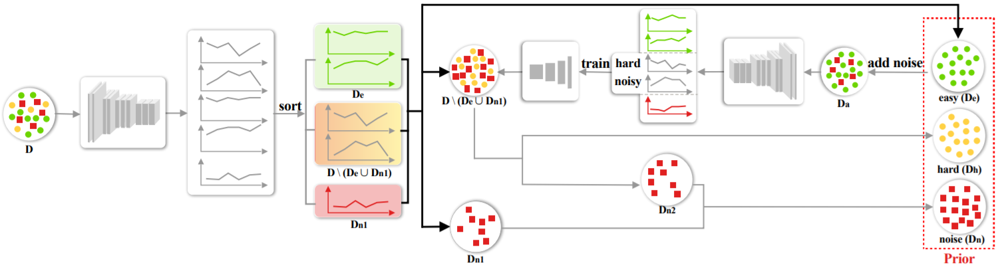
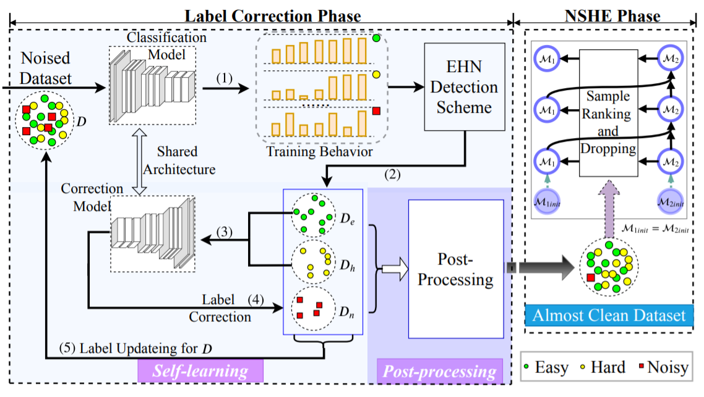

# CVSM Group

[***Homepage***](https://teacher.bupt.edu.cn/zhuchuang/en/index.htm) | [***Google Scholar***](https://scholar.google.com/citations?hl=zh-CN&user=FuCo7AkAAAAJ&view_op=list_works) | [***Researchgate***](https://www.researchgate.net/profile/Chuang_Zhu)

## ⚡News

- ***We released the code of [PGDF](https://github.com/bupt-ai-cz/PGDF), which is the new SOTA of image classification with noisy labels.***

  

 

- ***We released the code of [HSA-NRL](https://github.com/bupt-ai-cz/HSA-NRL), and the paper was accepted by IEEE Transactions on Medical Imaging (TMI).***

  

 

- ***We released the code of [HHCL-ReID](https://github.com/bupt-ai-cz/HHCL-ReID), which is the new SOTA of unsupervised person re-identification.***

  

 

- ***We released the dataset of [BALNMP](https://github.com/bupt-ai-cz/BALNMP), which can be used for predicting axillary lymph node metastasis in early breast cancer and the paper was accepted by Frontiers in Oncology.***

  

 

- ***We released the dataset of [LLVIP](https://bupt-ai-cz.github.io/LLVIP/), which was accepted by 2021 ICCV workshop.***

  

 

- ***We released the code and dataset of [Meta Self-Learning](https://bupt-ai-cz.github.io/Meta-SelfLearning/), which was accepted by 2021 ICCV workshop.***

  

 

## ⭐Ours Repositories

| [PGDF](https://github.com/bupt-ai-cz/PGDF) | [HSA-NRL](https://github.com/bupt-ai-cz/HSA-NRL) | [HHCL-ReID](https://github.com/bupt-ai-cz/HHCL-ReID) | [BALNMP](https://github.com/bupt-ai-cz/BALNMP) | [LLVIP](https://github.com/bupt-ai-cz/LLVIP) | [Meta Self-Learning](https://github.com/bupt-ai-cz/Meta-SelfLearning) | [IAST](https://github.com/bupt-ai-cz/IAST-ECCV2020) | [CAC-UNet](https://github.com/bupt-ai-cz/CAC-UNet-DigestPath2019) |
| :------------------------------------------: | :------------------------------------------------: | ---------------------------------------------------- | :------------------------------------------: | :----------------------------------------------------------: | :-------------------------------------------------: | :----------------------------------------------------------: | :----------------------------------------------------------: |
